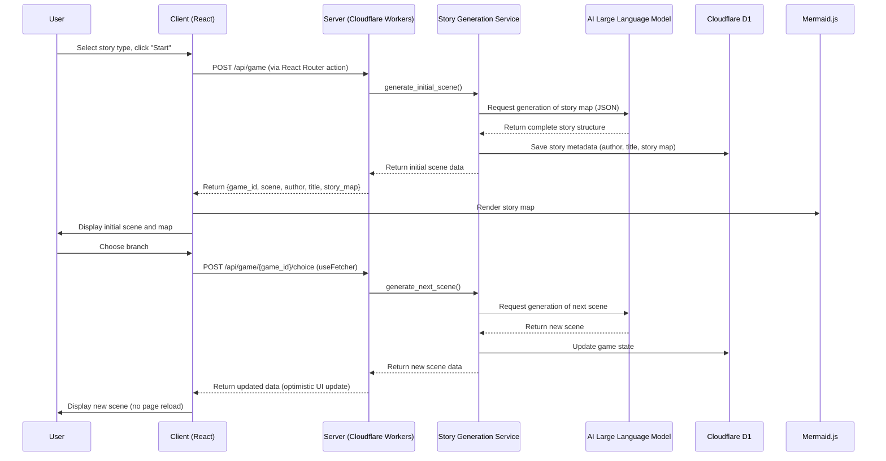

# 📖 AI Interactive Novel Generator

This is a dynamic interactive novel game powered by large language models (LLMs). It generates unique story plots, characters, and a visualized story development map in real-time based on the player's chosen story type, offering an immersive reading experience filled with unknowns and choices.

This project is migrating to a full-stack TypeScript architecture, utilizing React Router v7 for SSR/SPA hybrid mode, deployed on Cloudflare Workers.

---

## ✨ Core Features

*   **🤖 Dynamic Story Generation**: The game's core is AI-driven, capable of dynamically creating story beginnings, developments, and multiple endings based on preset literary styles (e.g., "Eastern Fantasy," "Western Fantasy").
*   **🎲 Randomized Authors and Works**: Each new game randomly generates an "author" and "title" that fit the selected type, enhancing the game's fun and immersion.
*   **🗺️ Visualized Story Map**: At the start of the game, the backend pre-generates the entire story structure map (Story Map), rendered on the frontend via [Mermaid.js](https://mermaid-js.github.io/mermaid/#/), allowing players to visually see potential branches and endings.
*   **🌿 Branching Narrative**: Each player choice influences the story's direction, leading to different plot branches and endings.
*   **🎨 Dynamic Writing Style**: The AI generates unique writing style descriptions based on the story type and applies them to the entire narrative, enhancing immersion.
*   **🌐 SSR and Client Hydration**: Supports server-side rendering (SSR) and client hydration for fast loading and consistent user experience.
*   **🔒 Frontend-Backend Separation**: Strictly separates server-only, shared, and client code to prevent sensitive information leaks.

---

## 🛠️ Tech Stack

| Category      | Technology                                                                 |
| :------------ | :------------------------------------------------------------------------- |
| **Framework** | [**React Router v7**](https://reactrouter.com/) - Isomorphic routing with SSR/SPA support. |
| **Build Tool**| [**Vite 7**](https://vitejs.dev/) - Fast build tool supporting SSR and client bundling. |
| **Styling**   | [**Tailwind CSS v4**](https://tailwindcss.com/) - Utility-first CSS framework. |
| **Runtime**   | [**Bun**](https://bun.sh/) - Fast JavaScript runtime and package manager. |
| **Database**  | [**Drizzle ORM**](https://orm.drizzle.team/) - Type-safe ORM for Cloudflare D1. |
| **Deployment**| [**Cloudflare Workers**](https://workers.cloudflare.com/) - Edge computing platform with D1 database support. |
| **AI**        | [**OpenAI GPT**](https://openai.com/) - Core engine for story generation. |
| **i18n**      | [**i18next**](https://www.i18next.com/) - Supports multi-language switching. |
| **Charts**    | [**Mermaid.js**](https://mermaid-js.github.io/mermaid/#/) - For rendering story maps. |

---

## 📂 Project Structure

```
.
├── app/                    # React Router app core
│   ├── root.tsx            # Main entry and layout
│   ├── routes/             # Route files (loader/action/component)
│   ├── components/         # Frontend components
│   │   ├── ui/             # Basic UI components
│   │   └── views/          # View components
│   ├── pages/              # Page components
│   ├── services/           # Business logic services (to be migrated)
│   └── models/             # Data models (to be migrated)
├── server/                 # Server-only code
│   ├── db/                 # Database schema and client
│   ├── services/           # Core business logic
│   └── config/             # Environment configuration
├── shared/                 # Shared types and schemas
│   ├── types/              # TypeScript type definitions
│   └── schemas/            # Zod schemas
├── scripts/                # Utility scripts
│   └── seed.ts             # Database seed data
├── .env.example            # Environment variables example
├── drizzle.config.ts       # Drizzle configuration
├── oxlint.json             # Oxlint configuration
├── package.json            # Project dependencies and scripts
├── tsconfig.json           # TypeScript configuration
├── vite.config.ts          # Vite configuration
└── README.md               # This document
```

---

## 🚀 Quick Start

Using Bun as the runtime and package manager, you can easily run this project locally.

**Prerequisites**:
*   [Bun](https://bun.sh/docs/installation) installed.

**Configuration**:

1.  **Install dependencies**:
    ```bash
    bun install
    ```

2.  **Create environment variables file**:
    The project uses `.env` files to manage sensitive configurations. We provide an example file `.env.example`; copy it to create your own config file:
    ```bash
    cp .env.example .env
    ```

3.  **Edit `.env` file**:
    Open the newly created `.env` file and fill in your OpenAI API key, Cloudflare account info, etc.

**Launch Steps**:

1.  **Local development**:
    ```bash
    bun run dev
    ```
    This starts the development server with hot reloading.

2.  **Build the project**:
    ```bash
    bun run build
    ```

3.  **Preview build results**:
    ```bash
    bun run preview
    ```

4.  **Access the app**:
    Open your browser and visit `http://localhost:5173` to start playing.

**Database Operations**:

- Generate migration files: `bun run db:generate`
- Local migration: `bun run db:migrate:local`
- Remote migration: `bun run db:migrate:remote`
- Seed data: `bun run db:seed`

---

## 🤝 Contributing

This project follows a strict Git workflow to ensure code quality and branch management.

### Git Workflow Rules

1. **NEVER commit directly to main branch**
2. **NEVER merge branches into main directly**
3. **NEVER push to main branch - EVER**
4. **ABSOLUTELY FORBIDDEN ACTIONS:**
   - `git push origin main` or `git push main`
   - `git merge feature-branch` while on main
   - Any direct commits to main branch

All changes to main MUST go through pull requests and code review process.

### Workflow

1. **Create a feature branch**:
   ```bash
   git checkout main
   git pull origin main
   git checkout -b feature/your-branch-name
   ```

2. **Make your changes and commit**:
   ```bash
   git add .
   git commit -m "feat: your commit message"
   ```

   Note: NEVER blindly `git add .` - there might be other unrelated files lying around.

   **NEVER use `git commit --amend` or `git push --force` unless explicitly asked by the user.**

3. **Lint**:
   ```bash
   bun run lint
   ```
   If there are lint errors, fix them.

4. **Format**:
   ```bash
   bun run format
   ```
   If there are formatting errors, fix them.

5. **Push and create PR**:
   ```bash
   git push -u origin feature/your-branch-name
   gh pr create --title "Your PR Title" --body "PR description"
   ```

6. **Wait for review and CI checks** before merging.

### Changelog

All user-facing changes must be documented in `CHANGELOG.md`. The changelog is enforced via GitHub Actions.

#### When to Update

**IMPORTANT: ALL merged PRs must be documented in the changelog.**

Update the changelog for EVERY pull request, including:

- New features or functionality
- Bug fixes
- Breaking changes
- API changes
- Provider additions or updates
- Configuration changes
- Performance improvements
- Dependency updates
- Test changes
- Build configuration changes
- CI/CD changes
- Documentation updates

#### Bypass Labels

PRs can bypass changelog requirements with one of these labels:

1. `no-changelog` - For exceptional cases (automated bot PRs, reverts of unmerged changes)
2. `dependencies` - For automated dependency updates (Dependabot, Renovate, etc.)

#### Changelog Format

This project follows [Keep a Changelog](https://keepachangelog.com/en/1.1.0/) format:

```markdown
# Changelog

All notable changes to this project will be documented in this file.

The format is based on [Keep a Changelog](https://keepachangelog.com/en/1.1.0/).

## [Unreleased]

### Added

- New features go here (#PR_NUMBER)

### Changed

- Changes to existing functionality (#PR_NUMBER)

### Fixed

- Bug fixes (#PR_NUMBER)

### Dependencies

- Dependency updates (#PR_NUMBER)

### Documentation

- Documentation changes (#PR_NUMBER)

### Tests

- Test additions or changes (#PR_NUMBER)

## [1.2.3] - 2025-10-15

### Added

- Feature that was added (#1234)
```

#### Entry Format

Each entry should:

1. **Include reference**: Add PR number `(#1234)` when available; use short commit hash `(abc1234)` only if no PR exists
2. **Use conventional commit prefix**: `feat:`, `fix:`, `chore:`, `docs:`, `test:`, `refactor:`
3. **Use `!` for breaking changes**: Add `!` after scope: `feat(api)!:`, `chore(cli)!:`
4. **Include contributor attribution**: Add `by @username` before reference when contributor is known
5. **Be concise**: One line describing the change
6. **Be user-focused**: Describe what changed, not how

#### Recommended Scopes

Use these standardized scopes for consistency (based on git history analysis):

- **providers** - Provider implementations (OpenAI, Anthropic, LocalAI, etc.)
- **webui** - Web interface and viewer
- **cli** - Command-line interface
- **assertions** - Assertion types and grading
- **api** - Public API changes
- **config** - Configuration handling
- **deps** - Dependencies (or use Dependencies section)
- **docs** - Documentation
- **tests** - Test infrastructure
- **examples** - Example configurations
- **redteam** - Red team features (newer versions)
- **site** - Documentation site

#### Categories

- **Added**: New features
- **Changed**: Changes to existing functionality (refactors, improvements, chores, CI/CD)
- **Fixed**: Bug fixes
- **Dependencies**: ALL dependency updates
- **Documentation**: Documentation additions or updates
- **Tests**: ALL test additions or changes
- **Removed**: Removed features (rare, usually breaking)

#### Examples

Good entries:

```markdown
### Added

- feat(providers): add TrueFoundry LLM Gateway provider (#5839)
- feat(redteam): add test button for request and response transforms in red-team setup UI (#5482)
- feat(cli): add glob pattern support for prompts (a1b2c3d)
- feat(api)!: simplify the API and support unified test suite definitions by @typpo (#14)

### Fixed

- fix(evaluator): support `defaultTest.options.provider` for model-graded assertions (#5931)
- fix(webui): improve UI email validation handling when email is invalid; add better tests (#5932)
- fix(cache): ensure cache directory exists before first use (423f375)

### Changed

- chore(providers): update Alibaba model support (#5919)
- chore(env)!: rename `OPENAI_MAX_TEMPERATURE` to `OPENAI_TEMPERATURE` (4830557)
- refactor(webui): improve EvalOutputPromptDialog with grouped dependency injection (#5845)
```

Bad entries (missing reference, too vague, inconsistent format):

```markdown
### Added

- Added new feature
- Updated provider
- New feature here
```

#### Adding Entries

1. **Add to Unreleased section**: All new entries go under `## [Unreleased]` at the top of the file
2. **Choose correct category**: Added, Changed, Fixed, Dependencies, Documentation, Tests
3. **Include reference**: PR number `(#1234)` when available, or short commit hash `(abc1234)` if no PR
4. **Keep conventional commit prefix**: feat:, fix:, chore:, docs:, test:
5. **One line per change**: Brief and descriptive

Example workflow:

```bash
# 1. Make your changes
# 2. Before creating PR, update CHANGELOG.md

# Add entry under ## [Unreleased] in appropriate category:
- feat(providers): add new provider for XYZ (#PR_NUMBER)

# 3. Commit changelog with your changes
git add CHANGELOG.md
git commit -m "feat(providers): add new provider for XYZ"
```

#### Notes

- Maintainers move entries from Unreleased to versioned sections during releases
- Don't worry about version numbers - focus on the Unreleased section
- If unsure about categorization, use Changed
- ALL dependencies, tests, CI changes must be included (no exemptions)

---

## ⚙️ Workflow

The diagram below outlines the complete flow from player starting a game to story content presentation:



---

## 📜 License

This project is licensed under the MIT License. See the [LICENSE](LICENSE) file for details.

## Star History

[](https://www.star-history.com/#xiamuceer-j/AI-Gamble&Date)

