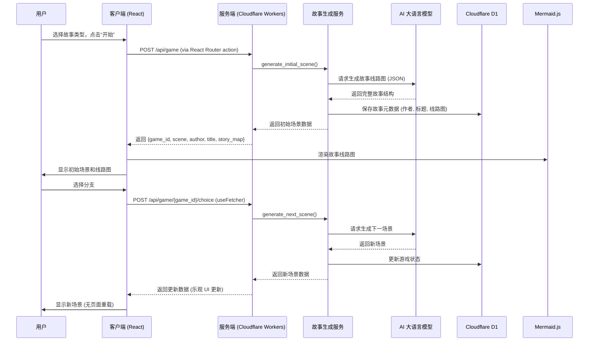

<file_path>
justplay/README_zh.md
</file_path>

<edit_description>
Create Chinese version of README as README_zh.md
</edit_description>

# 📖 AI 互动小说生成器

这是一个基于大型语言模型（LLM）的动态互动小说游戏。它能够根据玩家选择的故事类型，实时生成独特的故事情节、人物、以及一个可视化的故事发展线路图，为玩家提供一个充满未知和选择的沉浸式阅读体验。

本项目正在迁移到全栈 TypeScript 架构，使用 React Router v7 实现 SSR/SPA 混合模式，部署至 Cloudflare Workers。

---

## ✨ 核心功能

*   **🤖 动态故事生成**: 游戏的核心由 AI 驱动，能够根据预设的文学风格（如“东方玄幻”、“西方魔幻”）动态创作故事的开篇、发展和多重结局。
*   **🎲 随机化作家与作品**: 每次开启新游戏，系统都会随机生成符合所选类型的“作家”和“书名”，增加游戏的趣味性和代入感。
*   **🗺️ 可视化故事线路图**: 在游戏开始时，后端会预先生成整个故事的结构图（Story Map），并通过 [Mermaid.js](https://mermaid-js.github.io/mermaid/#/) 在前端渲染，让玩家可以直观地看到故事的潜在分支和结局。
*   **🌿 分支叙事**: 玩家的每一个选择都会影响故事的走向，导向不同的情节分支和最终结局。
*   **🎨 动态写作风格**: AI 会根据故事类型生成独特的写作风格描述，并应用于整个故事的叙述中，增强沉浸感。
*   **🌐 SSR 与客户端水合**: 支持服务端渲染（SSR）与客户端水合，确保快速加载和一致的用户体验。
*   **🔒 前后端分离**: 严格分离 server-only、shared 和 client 代码，避免泄露敏感信息。

---

## 🛠️ 技术栈

| 分类          | 技术                                                                 |
| :------------ | :------------------------------------------------------------------- |
| **框架**      | [**React Router v7**](https://reactrouter.com/) - 同构路由，支持 SSR/SPA。 |
| **构建工具**  | [**Vite 7**](https://vitejs.dev/) - 快速构建工具，支持 SSR 和客户端打包。 |
| **样式**      | [**Tailwind CSS v4**](https://tailwindcss.com/) - 功能类优先的 CSS 框架。 |
| **运行时**    | [**Bun**](https://bun.sh/) - 快速的 JavaScript 运行时和包管理器。     |
| **数据库**    | [**Drizzle ORM**](https://orm.drizzle.team/) - 类型安全的 ORM，用于 Cloudflare D1。 |
| **部署**      | [**Cloudflare Workers**](https://workers.cloudflare.com/) - 边缘计算平台，支持 D1 数据库。 |
| **AI**        | [**OpenAI GPT**](https://openai.com/) - 作为故事生成的核心引擎。     |
| **国际化**    | [**i18next**](https://www.i18next.com/) - 支持多语言切换。           |
| **图表**      | [**Mermaid.js**](https://mermaid-js.github.io/mermaid/#/) - 用于渲染故事线路图。 |

---

## 📂 项目结构

```
.
├── app/                    # React Router 应用核心
│   ├── root.tsx            # 主入口和布局
│   ├── routes/             # 路由文件（loader/action/component）
│   ├── components/         # 前端组件
│   │   ├── ui/             # 基础 UI 组件
│   │   └── views/          # 视图组件
│   ├── pages/              # 页面组件
│   ├── services/           # 业务逻辑服务（待迁移）
│   └── models/             # 数据模型（待迁移）
├── server/                 # 服务端专用代码
│   ├── db/                 # 数据库 schema 和客户端
│   ├── services/           # 核心业务逻辑
│   └── config/             # 环境配置
├── shared/                 # 共享类型和 schema
│   ├── types/              # TypeScript 类型定义
│   └── schemas/            # Zod schema
├── scripts/                # 工具脚本
│   └── seed.ts             # 数据库种子数据
├── .env.example            # 环境变量示例
├── drizzle.config.ts       # Drizzle 配置
├── oxlint.json             # Oxlint 配置
├── package.json            # 项目依赖和脚本
├── tsconfig.json           # TypeScript 配置
├── vite.config.ts          # Vite 配置
└── README.md               # 本文档
```

---

## 🚀 快速开始

使用 Bun 作为运行时和包管理器，你可以轻松地在本地运行本项目。

**先决条件**:
*   已安装 [Bun](https://bun.sh/docs/installation)。

**配置**:

1.  **安装依赖**:
    ```bash
    bun install
    ```

2.  **创建环境变量文件**:
    项目使用 `.env` 文件来管理敏感配置。我们提供了一个示例文件 `.env.example`，您可以复制它来创建自己的配置文件：
    ```bash
    cp .env.example .env
    ```

3.  **编辑 `.env` 文件**:
    打开新创建的 `.env` 文件，并填入您的 OpenAI API 密钥、Cloudflare 账户信息等。

**启动步骤**:

1.  **本地开发**:
    ```bash
    bun run dev
    ```
    这将启动开发服务器，支持热重载。

2.  **构建项目**:
    ```bash
    bun run build
    ```

3.  **预览构建结果**:
    ```bash
    bun run preview
    ```

4.  **访问应用**:
    打开浏览器，访问 `http://localhost:5173` 即可开始游戏。

**数据库操作**:

- 生成迁移文件: `bun run db:generate`
- 本地迁移: `bun run db:migrate:local`
- 远程迁移: `bun run db:migrate:remote`
- 种子数据: `bun run db:seed`

---

## 🤝 贡献指南

本项目遵循严格的 Git 工作流程，确保代码质量和分支管理。

### Git Workflow 规则

1. **绝不直接提交到 main 分支**
2. **绝不直接合并分支到 main**
3. **绝不推送 main 分支**
4. **禁止操作**:
   - `git push origin main` 或 `git push main`
   - `git merge feature-branch` 在 main 分支上
   - 任何直接提交到 main 分支

所有更改必须通过 Pull Request (PR) 和代码审查流程进入 main。

### 工作流程

1. **创建功能分支**:
   ```bash
   git checkout main
   git pull origin main
   git checkout -b feature/your-branch-name
   ```

2. **进行更改并提交**:
   ```bash
   git add .
   git commit -m "feat: your commit message"
   ```

   注意：不要盲目 `git add .`，确保只添加相关文件。

   **禁止**：`git commit --amend` 或 `git push --force`（除非明确要求）。

3. **Lint**:
   ```bash
   bun run lint
   ```
   如有错误，修复它们。

4. **Format**:
   ```bash
   bun run format
   ```
   如有格式错误，修复它们。

5. **推送并创建 PR**:
   ```bash
   git push -u origin feature/your-branch-name
   gh pr create --title "Your PR Title" --body "PR description"
   ```

6. **等待审查和 CI 检查**后再合并。

### Changelog

所有面向用户的更改必须记录在 `CHANGELOG.md` 中。Changelog 通过 GitHub Actions 强制执行。

#### 更新时机

**重要**：所有合并的 PR 必须记录在 changelog 中。

更新每个 PR，包括：
- 新功能
- 错误修复
- 重大更改
- API 更改
- 提供商添加或更新
- 配置更改
- 性能改进
- 依赖更新
- 测试更改
- 构建配置更改
- CI/CD 更改
- 文档更新

#### 绕过标签

PR 可以使用以下标签绕过 changelog 要求：
1. `no-changelog` - 适用于特殊情况（自动机器人 PR、未合并更改的还原）
2. `dependencies` - 适用于自动依赖更新（Dependabot、Renovate 等）

#### Changelog 格式

项目遵循 [Keep a Changelog](https://keepachangelog.com/en/1.1.0/) 格式：

```markdown
# Changelog

All notable changes to this project will be documented in this file.

The format is based on [Keep a Changelog](https://keepachangelog.com/en/1.1.0/).

## [Unreleased]

### Added

- New features go here (#PR_NUMBER)

### Changed

- Changes to existing functionality (#PR_NUMBER)

### Fixed

- Bug fixes (#PR_NUMBER)

### Dependencies

- Dependency updates (#PR_NUMBER)

### Documentation

- Documentation changes (#PR_NUMBER)

### Tests

- Test additions or changes (#PR_NUMBER)

## [1.2.3] - 2025-10-15

### Added

- Feature that was added (#1234)
```

#### 条目格式

每个条目应：
1. **包含引用**：添加 PR 编号 `(#1234)`（可用时）；仅在无 PR 时使用短提交哈希 `(abc1234)`
2. **使用传统提交前缀**：`feat:`、`fix:`、`chore:`、`docs:`、`test:`、`refactor:`
3. **对重大更改使用 `!`**：在范围后添加 `!`：`feat(api)!:`、`chore(cli)!:`
4. **包含贡献者归属**：在引用前添加 `by @username`（已知贡献者时）
5. **保持简洁**：一行描述更改
6. **面向用户**：描述更改内容而非方式

#### 推荐范围

使用这些标准化范围以保持一致性（基于 git 历史分析）：
- **providers** - 提供商实现（OpenAI、Anthropic、LocalAI 等）
- **webui** - Web 界面和查看器
- **cli** - 命令行界面
- **assertions** - 断言类型和评分
- **api** - 公共 API 更改
- **config** - 配置处理
- **deps** - 依赖项（或使用 Dependencies 部分）
- **docs** - 文档
- **tests** - 测试基础设施
- **examples** - 示例配置
- **redteam** - Red team 功能（较新版本）
- **site** - 文档站点

#### 类别

- **Added**：新功能
- **Changed**：现有功能更改（重构、改进、chore、CI/CD）
- **Fixed**：错误修复
- **Dependencies**：所有依赖更新
- **Documentation**：文档添加或更新
- **Tests**：所有测试添加或更改
- **Removed**：移除功能（罕见，通常重大）

#### 示例

良好条目：
```markdown
### Added

- feat(providers): add TrueFoundry LLM Gateway provider (#5839)
- feat(redteam): add test button for request and response transforms in red-team setup UI (#5482)
- feat(cli): add glob pattern support for prompts (a1b2c3d)
- feat(api)!: simplify the API and support unified test suite definitions by @typpo (#14)

### Fixed

- fix(evaluator): support `defaultTest.options.provider` for model-graded assertions (#5931)
- fix(webui): improve UI email validation handling when email is invalid; add better tests (#5932)
- fix(cache): ensure cache directory exists before first use (423f375)

### Changed

- chore(providers): update Alibaba model support (#5919)
- chore(env)!: rename `OPENAI_MAX_TEMPERATURE` to `OPENAI_TEMPERATURE` (4830557)
- refactor(webui): improve EvalOutputPromptDialog with grouped dependency injection (#5845)
```

不良条目（缺少引用、过于模糊、不一致格式）：
```markdown
### Added

- Added new feature
- Updated provider
- New feature here
```

#### 添加条目

1. **添加到 Unreleased 部分**：所有新条目进入 `## [Unreleased]` 顶部
2. **选择正确类别**：Added、Changed、Fixed、Dependencies、Documentation、Tests
3. **包含引用**：PR 编号 `(#1234)`（可用时），或短提交哈希 `(abc1234)`（无 PR 时）
4. **保持传统提交前缀**：feat:、fix:、chore:、docs:、test:
5. **每更改一行**：简短且描述性

示例工作流程：
```bash
# 1. 进行更改
# 2. 创建 PR 前，更新 CHANGELOG.md

# 在 ## [Unreleased] 的适当类别中添加条目：
- feat(providers): add new provider for XYZ (#PR_NUMBER)

# 3. 与更改一起提交 changelog
git add CHANGELOG.md
git commit -m "feat(providers): add new provider for XYZ"
```

#### 注意事项

- 维护者会在发布期间将条目从 Unreleased 移动到版本化部分
- 不要担心版本号 - 专注于 Unreleased 部分
- 如不确定分类，使用 Changed
- 所有依赖、测试、CI 更改必须包含（无例外）

---

## ⚙️ 工作流程

下图简要描述了从玩家开始游戏到故事内容呈现的完整流程：



---

## 📜 许可证

本项目采用 MIT 许可证。详情请见 [LICENSE](LICENSE) 文件。

## Star History

[](https://www.star-history.com/#xiamuceer-j/AI-Gamble&Date)

